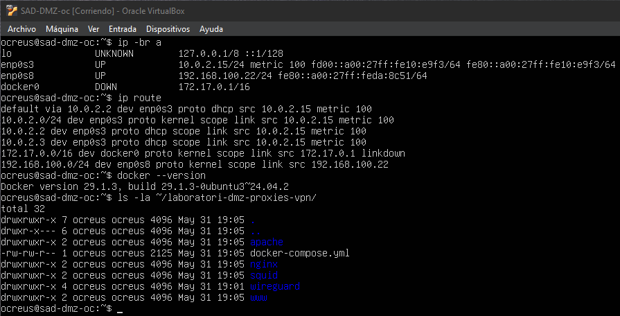
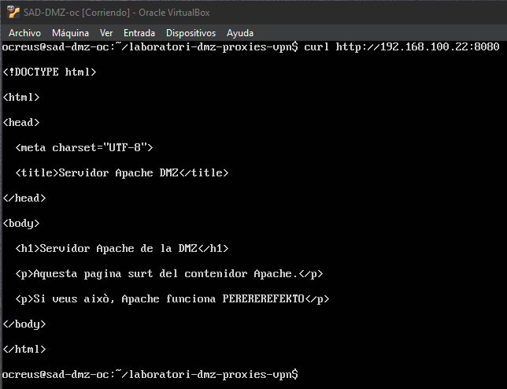
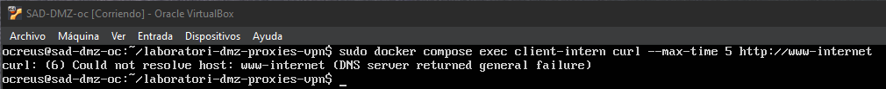
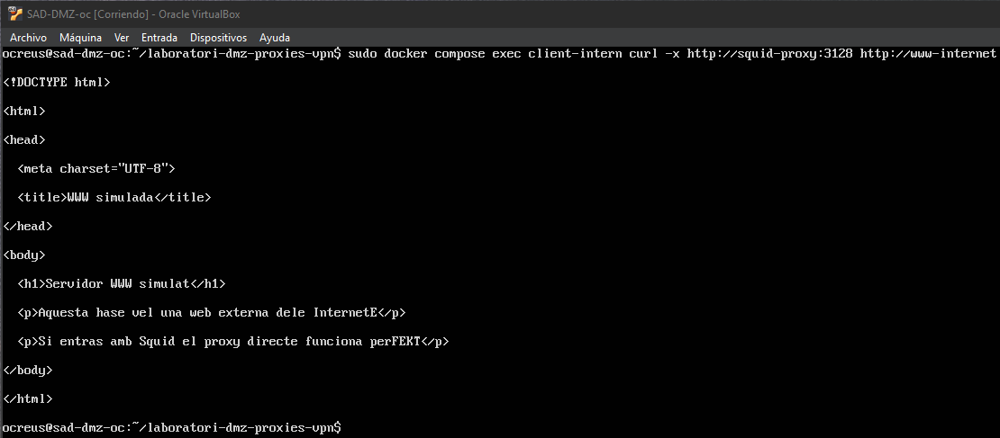
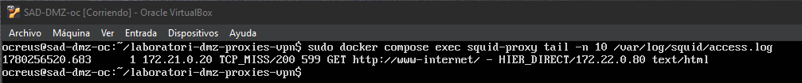
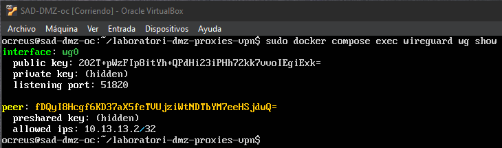
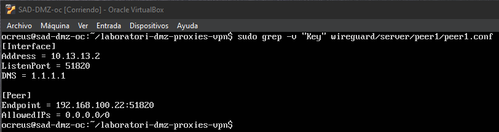
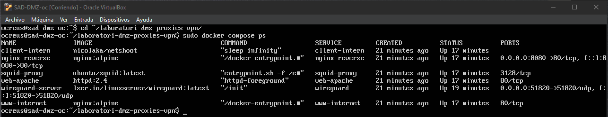
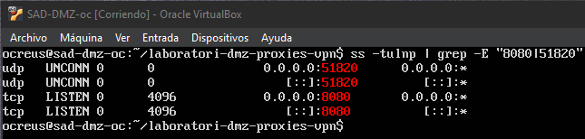

# Laboratori de xarxa: DMZ, proxies i VPN

## Objectiu de la pràctica

En aquesta pràctica he muntat un laboratori de xarxa per provar diferents serveis relacionats amb una DMZ, proxies i VPN. La idea era tenir un servidor Apache, un proxy invers amb nginx, un proxy directe amb Squid i un servidor WireGuard per simular una VPN. A diferència d'altres pràctiques, aquesta l'he fet només amb una màquina virtual, `SAD-DMZ`. Dins d'aquesta màquina he utilitzat Docker Compose per simular diferents serveis i xarxes fent que no calgui crear moltes màquines virtuals i queda tot més ordenat dins d'una sola VM. La màquina `SAD-DMZ` té la IP `192.168.100.22/24` i és on he muntat tota la practica.

---

# 1. Preparació de l'entorn

Per començar he utilitzat la màquina `SAD-DMZ`, que ja tenia configurada amb Ubuntu i connexió de xarxa. Aquesta màquina té una interfície NAT per tenir Internet i una interfície interna amb la IP `192.168.100.22/24`.

Primer he comprovat la configuració de xarxa amb:

```bash
ip -br a
ip route
```

També he comprovat que el Docker estigués instal·lat:

```bash
docker --version
```

Després he creat la carpeta de la pràctica:

```bash
mkdir -p ~/laboratori-dmz-proxies-vpn
cd ~/laboratori-dmz-proxies-vpn
```

Dins d'aquesta carpeta he creat diferents carpetes per tenir cada servei separat:

```bash
mkdir -p apache nginx squid wireguard/server wireguard/client www
```

La idea és que `apache` tingui la pàgina web interna, `nginx` tingui la configuració del proxy invers, `squid` tingui la configuració del proxy directe, `wireguard` tingui els fitxers de la VPN i `www` sigui una web externa simulada.



En aquesta captura es pot veure la IP de la màquina `SAD-DMZ`, la versió de Docker i les carpetes que he creat per organitzar la pràctica.

---

# 2. Servidor Apache per provar les peticions

El primer servei que he preparat ha sigut Apache que fa de servidor web intern dins de la DMZ. La idea és que després no accedim directament a Apache, sinó que ho fem a través del proxy invers nginx.

He creat una pàgina web simple amb:

```bash
sudo nano apache/index.html 
'EOF'
<!DOCTYPE html>
<html>
<head>
  <meta charset="UTF-8">
  <title>Servidor Apache DMZ</title>
</head>
<body>
  <h1>Servidor Apache de la DMZ</h1>
  <p>Aquesta pagina surt del contenidor Apache.</p>
  <p>Si veus això, Apache funciona PEREREREFEKTO.</p>
</body>
</html>
EOF
```

Aquesta pàgina només serveix per comprovar que Apache respon. No és una web real, és simplement una pàgina de prova per saber que el servei funciona.

En el fitxer `docker-compose.yml` he configurat el servei d’Apache amb la imatge `httpd:2.4`. Aquesta imatge ja porta Apache preparat, així que no he hagut d’instal·lar-lo a mano dins del contenidor. El contenidor li posat el nom `web-apache` i he connectat el fitxer `apache/index.html` de la meva carpeta local amb la ruta interna d’Apache, que és `/usr/local/apache2/htdocs/index.html`. D’aquesta manera, quan Apache arrenca, mostra la pàgina HTML que he creat jo i no la pàgina per defecte.

---

# 3. Proxy invers amb nginx

Després he configurat nginx com un proxy invers que servira perquè les peticions de fora no vagin directament al servidor web intern, sinó que primer passin per nginx. Quan entro a `192.168.100.22:8080`, realment estic entrant a nginx. Després nginx envia la petició cap al contenidor Apache. He creat la configuració de nginx amb:

```bash
sudo nano nginx/default.conf
'EOF'
server {
    listen 80;

    location / {
        proxy_pass http://web-apache:80;
        proxy_set_header Host $host;
        proxy_set_header X-Real-IP $remote_addr;
        proxy_set_header X-Forwarded-For $proxy_add_x_forwarded_for;
    }
}
EOF
```

Aquesta configuració fa que nginx escolti per el port `80` dins del contenidor i reenvii les peticions cap a `web-apache`.

Al `docker-compose.yml`, aquest servei l'he publicat al port `8080` de la màquina `SAD-DMZ`. Per això puc entrar fent:

```bash
curl http://192.168.100.22:8080
```

El resultat és la pàgina d'Apache:

```html
<h1>Servidor Apache de la DMZ</h1>
```



En aquesta captura es veu que quan faig una petició al port `8080`, respon la pàgina d'Apache. Això confirma que nginx està fent de proxy invers correctament.

---

# 4. Proxy directe amb Squid

Després he configurat Squid com a proxy directe. Un proxy directe és el que fa servir un client per sortir cap a fora. En aquesta pràctica he simulat un client intern i una web externa, tot dins de Docker. La idea és que el client intern no pugui arribar directament a la web simulada, però sí que pugui arribar si passa per Squid. Això és el comportament que volia demostrar.

He creat la configuració de Squid amb:

```bash
sudo nano squid/squid.conf
'EOF'
http_port 3128

acl xarxa_interna src 172.21.0.0/24

http_access allow xarxa_interna
http_access deny all

access_log /var/log/squid/access.log
visible_hostname squid-proxy
EOF
```

Aquí li estic dient a Squid que escolti pel port `3128` i que només permeti trànsit des de la xarxa interna `172.21.0.0/24`. Això és important perquè no vui que Squid sigui un proxy obert per qualsevol, sinó només pels clients interns del laboratori.

---

## 4.1 Prova sense proxy

Primer he provat que el client intern no pogués arribar directament a la web simulada.

He executat:

```bash
sudo docker compose exec client-intern curl --max-time 5 http://www-internet
```

El resultat ha sigut un error de resolució:

```text
Could not resolve host: www-internet
```



Aquesta captura és important encara que surti error, perquè justament demostra que el client intern no arriba directament a la web simulada. Aquí no és que estigui malament, és la prova que sense proxy no funciona.

---

## 4.2 Prova amb Squid

Després he fet la mateixa prova però utilitzant Squid com a proxy:

```bash
sudo docker compose exec client-intern curl -x http://squid-proxy:3128 http://www-internet
```

Ara sí que respon la web simulada:

```html
<h1>Servidor WWW simulat</h1>
```



Aqui podem veure que el client intern pot arribar a la web simulada quan fa servir Squid. Per tant, el proxy directe funciona.

---

## 4.3 Logs de Squid

Per comprovar que Squid realment estava gestionant les peticions, he mirat el fitxer de logs:

```bash
sudo docker compose exec squid-proxy tail -n 10 /var/log/squid/access.log
```

En el log apareixen línies com:

```text
TCP_MISS/200
TCP_REFRESH_UNMODIFIED/200
```



Això confirma que Squid ha rebut les peticions del client intern i les ha enviat cap a la web simulada. Si no aparegués res al log, seria mala senyal, perquè voldria dir que el trànsit no està passant per Squid.

---

# 5. Servidor WireGuard per la VPN

També he muntat un servidor WireGuard dins de Docker. WireGuard per crear una VPN, he configurat el servidor i s'ha generat la configuració del client. El contenidor de WireGuard està publicat al port UDP `51820`, que és el port que faria servir un client VPN per connectar-se.

Al `docker-compose.yml`, WireGuard està configurat amb la imatge:

```text
lscr.io/linuxserver/wireguard:latest
```

La configuració important és que el servidor utilitza com a IP pública o endpoint la IP de `SAD-DMZ`:

```text
192.168.100.22
```

I el port:

```text
51820
```

Per comprovar que WireGuard estava actiu he executat:

```bash
sudo docker compose exec wireguard wg show
```



En aquesta captura es veu la interfície `wg0`, el port `51820` i un peer creat. Això vol dir que el servidor WireGuard està aixecat i té un client preparat.

---

## 5.1 Configuració del client WireGuard

WireGuard també ha generat un fitxer de configuració pel client. Aquest fitxer està a:

```text
wireguard/server/peer1/peer1.conf
```

Per no ensenyar claus privades ja que al projecte es va indicar que no es podia publicar a github dades "sensibles" a la documentació, he fet servir aquesta comanda:

```bash
sudo grep -v "Key" wireguard/server/peer1/peer1.conf
```

Això ensenya la configuració important però amaga les línies de claus.



En aquesta captura es veu que el client tindria la IP `10.13.13.2`, que l'endpoint és `192.168.100.22:51820` i que `AllowedIPs` està configurat com `0.0.0.0/0`.

No he fet una connexió real des d'un client extern de WireGuard. El que he fet en aquesta pràctica és deixar el servidor muntat, actiu i amb la configuració del client generada. Ho poso així perquè és millor no vendre fum: el servidor està funcionant, però no s'ha provat una connexió VPN des d'un altre dispositiu.

---

# 6. Docker Compose amb diverses xarxes

La pràctica s'ha muntat amb Docker Compose. Això permet simular diferents serveis i diferents xarxes dins d'una sola màquina virtual.

El fitxer principal és:

```text
docker-compose.yml
```

Aquest fitxer crea diferents contenidors: Apache, nginx, Squid, WireGuard, un client intern i una web simulada. El fitxer també crea diverses xarxes Docker. He utilitzat una xarxa per la DMZ, una xarxa interna i una xarxa que simula Internet.

El `docker-compose.yml` utilitzat és aquest:

```yaml
services:
  web-apache:
    image: httpd:2.4
    container_name: web-apache
    volumes:
      - ./apache/index.html:/usr/local/apache2/htdocs/index.html:ro
    networks:
      dmz_net:
        ipv4_address: 172.20.0.10

  nginx-reverse:
    image: nginx:alpine
    container_name: nginx-reverse
    ports:
      - "8080:80"
    volumes:
      - ./nginx/default.conf:/etc/nginx/conf.d/default.conf:ro
    networks:
      dmz_net:
        ipv4_address: 172.20.0.20
    depends_on:
      - web-apache

  squid-proxy:
    image: ubuntu/squid:latest
    container_name: squid-proxy
    volumes:
      - ./squid/squid.conf:/etc/squid/squid.conf:ro
    networks:
      internal_net:
        ipv4_address: 172.21.0.10
      internet_net:
        ipv4_address: 172.22.0.10

  www-internet:
    image: nginx:alpine
    container_name: www-internet
    volumes:
      - ./www/index.html:/usr/share/nginx/html/index.html:ro
    networks:
      internet_net:
        ipv4_address: 172.22.0.80

  client-intern:
    image: nicolaka/netshoot
    container_name: client-intern
    command: sleep infinity
    networks:
      internal_net:
        ipv4_address: 172.21.0.20

  wireguard:
    image: lscr.io/linuxserver/wireguard:latest
    container_name: wireguard-server
    cap_add:
      - NET_ADMIN
      - SYS_MODULE
    environment:
      - PUID=1000
      - PGID=1000
      - TZ=Europe/Madrid
      - SERVERURL=192.168.100.22
      - SERVERPORT=51820
      - PEERS=1
      - PEERDNS=1.1.1.1
      - INTERNAL_SUBNET=10.13.13.0
      - ALLOWEDIPS=0.0.0.0/0
    volumes:
      - ./wireguard/server:/config
      - /lib/modules:/lib/modules
    ports:
      - "51820:51820/udp"
    sysctls:
      - net.ipv4.conf.all.src_valid_mark=1
    networks:
      dmz_net:
        ipv4_address: 172.20.0.30
    restart: unless-stopped

networks:
  dmz_net:
    driver: bridge
    ipam:
      config:
        - subnet: 172.20.0.0/24

  internal_net:
    driver: bridge
    ipam:
      config:
        - subnet: 172.21.0.0/24

  internet_net:
    driver: bridge
    ipam:
      config:
        - subnet: 172.22.0.0/24
```

Per aixecar tota la infraestructura he executat:

```bash
sudo docker compose up -d
```

Al principi m'he trobat amb un problema amb Squid, perquè el port `3128` ja estava ocupat a la màquina host. Per solucionar-ho, he tret la publicació del port `3128` cap al host, perquè realment no feia falta. El client que fa servir Squid està dintre de Docker, per tant pot accedir a Squid directament pel nom del contenidor `squid-proxy`.

Després he comprovat els contenidors amb:

```bash
sudo docker compose ps
```



En aquesta captura es veu que tots els contenidors estan aixecats. També es veu que nginx publica el port `8080` i WireGuard publica el port UDP `51820`.

---

# 7. Ports publicats

Per comprovar els ports oberts a la màquina `SAD-DMZ`, he executat:

```bash
ss -tulnp | grep -E "8080|51820"
```



Aquí es veu que el port `8080` està escoltant per TCP i el port `51820` està escoltant per UDP.

El port `8080` correspon al proxy invers nginx. El port `51820` correspon al servidor WireGuard.

---

# Problemes trobats durant la pràctica

## Problema amb permisos de Docker

Al principi he intentat aixecar els contenidors amb:

```bash
docker compose up -d
```

Però m'ha sortit un error de permisos amb el socket de Docker.

La solució ha sigut executar Docker amb `sudo`:

```bash
sudo docker compose up -d
```

També es podria afegir l'usuari al grup `docker`, però per aquesta pràctica he preferit fer amb `sudo` i no perdre temps.

---

## Problema amb el port 3128 de Squid

Quan he aixecat els contenidors, Squid ha fallat perquè el port `3128` ja estava ocupat al host. L'error deia que Docker no podia publicar el port `3128`. Al principi pot liar una mica, però en realitat la solució era bastant simple: no feia falta publicar Squid cap al host. El client que utilitza Squid està dins de Docker, així que pot accedir al proxy pel nom `squid-proxy`.

He eliminat aquesta part del servei Squid:

```yaml
ports:
  - "3128:3128"
```

Després he fet:

```bash
sudo docker compose down
sudo docker compose up -d
```

I ja s'ha aixecat sense cap problema.

---

## Prova sense proxy

La prova sense proxy donava aquest error:

```text
Could not resolve host: www-internet
```

Això no ho considero un error de la pràctica, sinó una comprovació útil. Serveix per veure que el client intern no pot arribar directament a la web simulada. Després, quan faig la mateixa petició utilitzant Squid, sí que funciona. Això deixa clar que el proxy directe està fent la seva feina.

---

## WireGuard no provat amb client extern

WireGuard està aixecat i ha generat el fitxer `peer1.conf`, però no he connectat un client extern real. Això és important dir-ho clar. En aquesta pràctica he arribat fins a tenir el servidor WireGuard actiu, el port UDP `51820` escoltant i la configuració del client generada. Per tant, la part de servidor VPN queda muntada, però no he fet una prova real de connexió des d'un altre dispositiu.

---

# Comprovacions finals

Per comprovar la màquina i l'entorn he utilitzat:

```bash
ip -br a
ip route
docker --version
ls -la ~/laboratori-dmz-proxies-vpn
```

Per comprovar que els contenidors estaven aixecats:

```bash
sudo docker compose ps
```

Per provar el proxy invers nginx:

```bash
curl http://192.168.100.22:8080
```

Per comprovar que el client intern no arribava directament a la web simulada:

```bash
sudo docker compose exec client-intern curl --max-time 5 http://www-internet
```

Per comprovar que amb Squid sí que arribava:

```bash
sudo docker compose exec client-intern curl -x http://squid-proxy:3128 http://www-internet
```

Per veure els logs de Squid:

```bash
sudo docker compose exec squid-proxy tail -n 10 /var/log/squid/access.log
```

Per comprovar WireGuard:

```bash
sudo docker compose exec wireguard wg show
```

Per veure la configuració del client WireGuard sense mostrar claus:

```bash
sudo grep -v "Key" wireguard/server/peer1/peer1.conf
```

Per comprovar els ports publicats:

```bash
ss -tulnp | grep -E "8080|51820"
```
